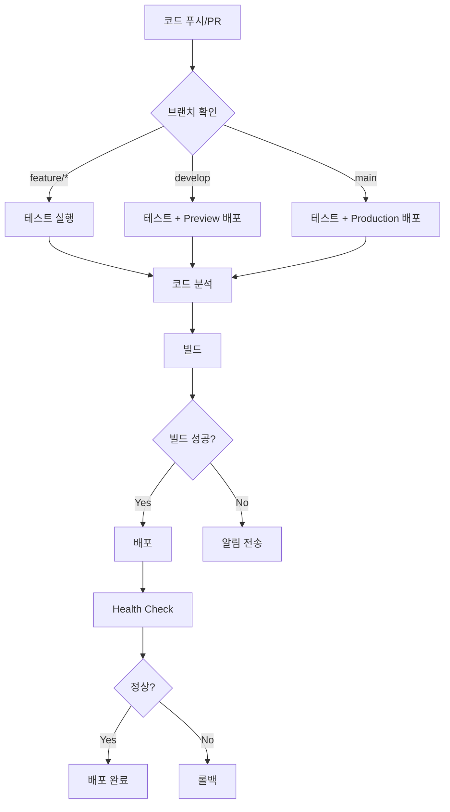

# 🚀 배포 및 CI/CD 전략 계획서

> Uncany 프로젝트의 지속적 통합/배포(CI/CD) 및 운영 전략

**작성일**: 2026-01-04
**대상 플랫폼**: Flutter Web, iOS, Android
**주요 목표**: 모바일 환경에서도 원활한 개발 및 배포 가능

---

## 📋 목차

1. [전체 개요](#전체-개요)
2. [현재 상태 분석](#현재-상태-분석)
3. [CI/CD 파이프라인 설계](#cicd-파이프라인-설계)
4. [배포 전략](#배포-전략)
5. [모바일 워크플로우](#모바일-워크플로우)
6. [환경 관리](#환경-관리)
7. [보안 전략](#보안-전략)
8. [구현 로드맵](#구현-로드맵)

---

## 🎯 전체 개요

### 프로젝트 요구사항

1. **모바일 중심 개발**: 로컬 머신 접근 없이 모바일에서 작업 가능
2. **자동화된 테스트**: PR 및 푸시 시 자동 테스트 실행
3. **다중 플랫폼 배포**: Web, iOS, Android 동시 지원
4. **즉시 테스트 가능**: 배포 빌드를 통한 실제 환경 테스트
5. **문서 자동화**: 작업 중단 시에도 재개 가능하도록 문서화

### 핵심 원칙

- **Zero Local Dependency**: GitHub Actions로 모든 빌드/테스트 자동화
- **Preview Deployments**: PR마다 미리보기 배포 생성
- **Environment Isolation**: Dev/Staging/Production 환경 분리
- **Security First**: 환경 변수 및 시크릿 안전 관리

---

## 📊 현재 상태 분석

### ✅ 이미 구현된 것

#### GitHub Actions 워크플로우

1. **`.github/workflows/test.yml`** - 테스트 자동화
   - Flutter 분석 (analyze)
   - 코드 포맷 검사
   - 유닛 테스트 실행
   - 코드 커버리지 업로드 (Codecov)
   - PR 커버리지 코멘트

2. **`.github/workflows/auto-docs.yml`** - 문서 자동화
   - 코드 통계 생성
   - PROJECT_PLAN.md 업데이트
   - Daily 로그 생성
   - 자동 커밋 및 푸시

#### 프로젝트 설정

- **Flutter 3.24+**: 안정 버전
- **Supabase 통합**: BaaS 연결
- **코드 생성**: Freezed, Riverpod 자동 생성
- **환경 변수**: `.env` 파일 기반

### ❌ 아직 구현되지 않은 것

1. **배포 자동화**: 빌드 후 호스팅 배포
2. **Preview 환경**: PR별 미리보기 배포
3. **모바일 빌드**: iOS/Android 자동 빌드
4. **환경 분리**: Dev/Staging/Production
5. **릴리스 자동화**: 버전 태깅 및 배포

---

## 🔄 CI/CD 파이프라인 설계

### 전체 플로우



### 파이프라인 단계

#### 1단계: 코드 품질 검증
```yaml
- 코드 포맷 검사 (flutter format)
- 정적 분석 (flutter analyze)
- 린트 규칙 준수 (analysis_options.yaml)
```

#### 2단계: 의존성 및 빌드
```yaml
- Flutter 의존성 설치 (flutter pub get)
- 코드 생성 (build_runner)
- 빌드 검증 (flutter build --dry-run)
```

#### 3단계: 테스트
```yaml
- 유닛 테스트 (flutter test)
- 위젯 테스트 (flutter test test/widget)
- 통합 테스트 (flutter test integration_test)
- 커버리지 리포트 생성
```

#### 4단계: 빌드
```yaml
Web:    flutter build web --release
iOS:    flutter build ios --release (macOS runner)
Android: flutter build appbundle --release
```

#### 5단계: 배포
```yaml
Web:     Firebase Hosting / Vercel
iOS:     TestFlight (beta) / App Store (production)
Android: Play Store (internal/beta/production)
```

---

## 🌐 배포 전략

### 플랫폼별 배포 방식

#### 1. Flutter Web 배포

**선택지 분석**

| 플랫폼 | 장점 | 단점 | 추천도 |
|--------|------|------|--------|
| **Firebase Hosting** | - 무료 SSL<br>- CDN 자동<br>- GitHub Actions 통합 쉬움 | - 커스텀 서버 불가 | ⭐⭐⭐⭐⭐ |
| **Vercel** | - 자동 Preview<br>- 빠른 배포<br>- GitHub 통합 완벽 | - 무료 플랜 제한 | ⭐⭐⭐⭐ |
| **GitHub Pages** | - 완전 무료<br>- GitHub 네이티브 | - 동적 라우팅 제한 | ⭐⭐⭐ |
| **Netlify** | - 자동 Preview<br>- 폼 처리 | - 빌드 시간 제한 | ⭐⭐⭐⭐ |

**✅ 추천: Firebase Hosting**

**이유**:
- Supabase와 궁합이 좋음 (모두 BaaS)
- 무료 SSL/CDN
- GitHub Actions 공식 액션 제공
- Preview 채널 지원
- 한국 CDN 노드 있음

**설정 방법**:
```bash
# 1. Firebase CLI 설치 (GitHub Actions에서)
npm install -g firebase-tools

# 2. Firebase 프로젝트 초기화
firebase init hosting

# 3. 배포
firebase deploy --only hosting
```

**환경별 채널**:
- **Production**: `uncany-prod.web.app`
- **Staging**: `uncany-staging.web.app`
- **Preview**: `uncany-pr-123.web.app` (PR별 자동 생성)

#### 2. iOS 배포

**제약사항**: macOS 러너 필요 (GitHub Actions 유료 or 별도 설정)

**단계별 배포**:

1. **개발 단계**: Xcode Simulator (로컬만 가능)
2. **베타 테스트**: TestFlight
3. **프로덕션**: App Store

**GitHub Actions 전략**:
```yaml
# Option 1: GitHub-hosted macOS runner (분당 $0.08)
runs-on: macos-latest

# Option 2: Self-hosted macOS runner (무료, 하지만 Mac 필요)
runs-on: self-hosted

# Option 3: Codemagic 사용 (무료 500분/월)
# Codemagic CI/CD를 GitHub와 연동
```

**✅ 추천: 초기엔 수동, 이후 Codemagic**

**이유**:
- 초기엔 배포 빈도가 낮음
- Codemagic 무료 플랜으로 충분
- macOS 러너 비용 절감

**수동 배포 절차**:
```bash
# 1. 로컬 또는 macOS 환경에서
flutter build ios --release

# 2. Xcode에서 Archive
open ios/Runner.xcworkspace

# 3. Organizer에서 TestFlight 업로드
```

#### 3. Android 배포

**제약사항**: 서명 키 필요

**단계별 배포**:

1. **개발 단계**: APK 직접 설치
2. **베타 테스트**: Play Store Internal/Closed Testing
3. **프로덕션**: Play Store Production

**GitHub Actions 전략**:
```yaml
# Android는 Linux runner에서 빌드 가능 (무료)
runs-on: ubuntu-latest

steps:
  - flutter build appbundle --release
  - fastlane supply (Play Store 업로드)
```

**✅ 추천: GitHub Actions 완전 자동화**

**이유**:
- Linux 러너는 무료
- Fastlane으로 자동 업로드 가능
- 서명 키만 GitHub Secrets에 저장하면 됨

**서명 키 설정**:
```bash
# 1. 키 생성 (로컬에서 한 번만)
keytool -genkey -v -keystore uncany-release.jks \
  -keyalg RSA -keysize 2048 -validity 10000 \
  -alias uncany

# 2. Base64 인코딩
base64 uncany-release.jks > uncany-release.jks.base64

# 3. GitHub Secrets에 저장
# - ANDROID_KEYSTORE_BASE64
# - ANDROID_KEYSTORE_PASSWORD
# - ANDROID_KEY_ALIAS
# - ANDROID_KEY_PASSWORD
```

### 환경별 배포 전략

#### Development (개발)
- **브랜치**: `feature/*`, `claude/*`
- **배포**: 빌드 검증만 (실제 배포 X)
- **목적**: CI 통과 확인

#### Staging (스테이징)
- **브랜치**: `develop`
- **배포**:
  - Web: `uncany-staging.web.app`
  - Android: Play Store Internal Testing
  - iOS: TestFlight (Beta 그룹)
- **목적**: 실제 환경 테스트

#### Production (프로덕션)
- **브랜치**: `main`
- **배포**:
  - Web: `uncany.web.app` (또는 커스텀 도메인)
  - Android: Play Store Production
  - iOS: App Store
- **목적**: 일반 사용자 제공

---

## 📱 모바일 워크플로우

### 문제: 로컬 머신 접근 불가

사용자가 주로 모바일에서 작업하므로, 다음이 어려움:
- Flutter 명령어 실행
- 코드 생성 (`build_runner`)
- 로컬 테스트 실행
- 빌드 및 배포

### 해결책: GitHub 중심 워크플로우

#### Option 1: GitHub Web Editor + Actions ⭐⭐⭐⭐⭐

**장점**:
- 설정 불필요
- 모바일 브라우저에서 바로 가능
- 모든 빌드/테스트는 GitHub Actions가 자동 처리

**워크플로우**:
```
1. GitHub 모바일 앱 or 웹 브라우저에서 파일 수정
2. 커밋 및 푸시
3. GitHub Actions가 자동으로:
   - 코드 생성 (build_runner)
   - 테스트 실행
   - 빌드
   - 배포
4. PR 생성 시 자동으로 Preview 배포
5. 모바일에서 Preview URL로 테스트
```

**GitHub 모바일 앱 활용**:
- 파일 수정: ✅ 가능
- 커밋/푸시: ✅ 가능
- PR 생성/리뷰: ✅ 가능
- Actions 로그 확인: ✅ 가능

#### Option 2: GitHub Codespaces ⭐⭐⭐⭐

**장점**:
- 클라우드 기반 VS Code
- 모바일 브라우저에서 전체 개발 환경 접근
- Flutter 설치 가능 (devcontainer)

**단점**:
- 무료 플랜: 60시간/월
- 모바일 화면에서 VS Code는 불편할 수 있음

**설정 방법**:
```json
// .devcontainer/devcontainer.json
{
  "name": "Flutter Dev",
  "image": "cirruslabs/flutter:stable",
  "features": {
    "ghcr.io/devcontainers/features/git:1": {}
  },
  "postCreateCommand": "flutter pub get && flutter pub run build_runner build"
}
```

#### Option 3: Gitpod ⭐⭐⭐

**장점**:
- Codespaces와 유사
- 무료 플랜: 50시간/월
- GitHub 통합

**단점**:
- Codespaces보다 설정 복잡

#### ✅ 추천: GitHub Web Editor + Actions

**이유**:
1. **완전 무료**: Actions 무료 시간 충분 (2,000분/월)
2. **설정 불필요**: 바로 시작 가능
3. **모바일 최적화**: GitHub 모바일 앱 UI
4. **자동화**: 모든 빌드/테스트 자동

### 모바일에서의 작업 프로세스

#### 1. 코드 수정

**방법 A: GitHub 모바일 앱**
```
1. GitHub 앱 열기
2. Repository → Files 탭
3. 수정할 파일 클릭
4. 연필 아이콘 (Edit) 클릭
5. 코드 수정
6. Commit changes
```

**방법 B: 모바일 웹 브라우저**
```
1. github.com → Repository
2. 파일 클릭 → "Edit this file" (연필 아이콘)
3. 수정 후 "Commit changes"
```

**방법 C: Working Copy (iOS) / MGit (Android)**
- Git 클라이언트 앱
- 로컬 클론 → 수정 → 푸시
- 더 강력하지만 학습 곡선 있음

#### 2. PR 생성 및 Preview 확인

```
1. 브랜치에 커밋 푸시
2. GitHub에서 "Compare & pull request"
3. PR 생성
4. GitHub Actions가 자동으로:
   - 테스트 실행
   - Preview 빌드
   - Firebase Preview 채널에 배포
5. PR 코멘트에 Preview URL 표시
6. 모바일 브라우저로 Preview URL 접속하여 테스트
```

#### 3. 빌드 상태 확인

**GitHub 모바일 앱**:
```
Repository → Actions 탭 → 워크플로우 선택 → 로그 확인
```

**실시간 알림**:
- GitHub 알림 활성화
- 빌드 실패 시 즉시 알림
- PR 코멘트로 테스트 결과 확인

#### 4. 배포 확인

**Web**:
- Preview URL 또는 Staging URL 접속
- 모바일 브라우저에서 직접 테스트

**Android**:
- Play Store Internal Testing 링크
- 모바일에서 직접 설치 및 테스트

**iOS**:
- TestFlight 링크
- 모바일에서 직접 설치 및 테스트

---

## 🔐 환경 관리

### 환경 변수 전략

#### 개발 환경별 변수

**Development**:
```env
ENVIRONMENT=development
SUPABASE_URL=https://dev-xxx.supabase.co
SUPABASE_ANON_KEY=dev_anon_key
```

**Staging**:
```env
ENVIRONMENT=staging
SUPABASE_URL=https://staging-xxx.supabase.co
SUPABASE_ANON_KEY=staging_anon_key
```

**Production**:
```env
ENVIRONMENT=production
SUPABASE_URL=https://prod-xxx.supabase.co
SUPABASE_ANON_KEY=prod_anon_key
```

### GitHub Secrets 설정

**Repository Secrets** (Settings → Secrets and variables → Actions):

```yaml
# Supabase
SUPABASE_URL_DEV
SUPABASE_ANON_KEY_DEV
SUPABASE_URL_STAGING
SUPABASE_ANON_KEY_STAGING
SUPABASE_URL_PROD
SUPABASE_ANON_KEY_PROD

# Firebase (Web 배포)
FIREBASE_TOKEN
FIREBASE_PROJECT_ID_STAGING
FIREBASE_PROJECT_ID_PROD

# Android
ANDROID_KEYSTORE_BASE64
ANDROID_KEYSTORE_PASSWORD
ANDROID_KEY_ALIAS
ANDROID_KEY_PASSWORD

# iOS (향후)
IOS_CERTIFICATE_BASE64
IOS_PROVISIONING_PROFILE_BASE64
```

### 환경별 빌드 설정

**flutter build 명령어에 환경 변수 주입**:

```yaml
# GitHub Actions에서
- name: Build Web (Staging)
  env:
    SUPABASE_URL: ${{ secrets.SUPABASE_URL_STAGING }}
    SUPABASE_ANON_KEY: ${{ secrets.SUPABASE_ANON_KEY_STAGING }}
  run: |
    flutter build web \
      --release \
      --dart-define=ENVIRONMENT=staging \
      --dart-define=SUPABASE_URL=$SUPABASE_URL \
      --dart-define=SUPABASE_ANON_KEY=$SUPABASE_ANON_KEY
```

**앱 코드에서 환경 변수 읽기**:

```dart
// lib/src/core/config/environment.dart
class Environment {
  static const String current = String.fromEnvironment(
    'ENVIRONMENT',
    defaultValue: 'development',
  );

  static const String supabaseUrl = String.fromEnvironment('SUPABASE_URL');
  static const String supabaseAnonKey = String.fromEnvironment('SUPABASE_ANON_KEY');

  static bool get isDevelopment => current == 'development';
  static bool get isStaging => current == 'staging';
  static bool get isProduction => current == 'production';
}
```

---

## 🔒 보안 전략

### 1. Secrets 관리

**절대 커밋하지 말 것**:
- `.env` 파일
- 서명 키 (`.jks`, `.p12`)
- API 키
- 비밀번호

**`.gitignore`에 추가**:
```gitignore
.env
.env.*
!.env.example
*.jks
*.p12
*.keystore
```

### 2. 코드 서명

**Android**:
- Release 키는 GitHub Secrets에만 저장
- Debug 키는 커밋 가능 (자동 생성)

**iOS**:
- Certificate와 Provisioning Profile은 Secrets에 저장
- Fastlane Match 사용 권장 (향후)

### 3. 브랜치 보호

**`main` 브랜치 설정** (Settings → Branches → Branch protection rules):
```yaml
- Require pull request reviews before merging
- Require status checks to pass (Tests, Build)
- Require branches to be up to date
- Do not allow bypassing the above settings
```

### 4. Dependabot

**자동 의존성 업데이트**:
```yaml
# .github/dependabot.yml
version: 2
updates:
  - package-ecosystem: "pub"
    directory: "/"
    schedule:
      interval: "weekly"
```

---

## 🗺️ 구현 로드맵

### Phase 1: 핵심 CI 강화 ⏰ 2-3시간

**목표**: 현재 테스트 워크플로우 개선

- [ ] `test.yml` 개선: 위젯 테스트, 통합 테스트 추가
- [ ] 코드 커버리지 목표 설정 (최소 70%)
- [ ] 빌드 검증 추가 (Web/Android)

### Phase 2: Web 배포 자동화 ⏰ 3-4시간

**목표**: Firebase Hosting 자동 배포

- [ ] Firebase 프로젝트 생성 (Staging, Production)
- [ ] Firebase Hosting 초기화
- [ ] GitHub Actions 워크플로우 작성:
  - `deploy-web-preview.yml` (PR별 Preview)
  - `deploy-web-staging.yml` (develop 브랜치)
  - `deploy-web-prod.yml` (main 브랜치)
- [ ] 환경 변수 설정 (`--dart-define`)
- [ ] PR 코멘트에 Preview URL 자동 추가

### Phase 3: Android 배포 자동화 ⏰ 4-5시간

**목표**: Play Store 자동 배포

- [ ] Android 서명 키 생성
- [ ] GitHub Secrets 설정
- [ ] Fastlane 설정 (선택사항)
- [ ] GitHub Actions 워크플로우 작성:
  - `deploy-android-internal.yml` (develop → Internal Testing)
  - `deploy-android-prod.yml` (main → Production)
- [ ] Play Store 콘솔 설정

### Phase 4: iOS 배포 (선택사항) ⏰ 6-8시간

**목표**: TestFlight 자동 배포

- [ ] Apple Developer 계정 설정
- [ ] Certificate 및 Provisioning Profile 생성
- [ ] GitHub Secrets 설정
- [ ] Fastlane Match 설정 (권장)
- [ ] GitHub Actions 워크플로우 (macOS runner 또는 Codemagic)

### Phase 5: 모니터링 및 알림 ⏰ 2시간

**목표**: 배포 상태 모니터링

- [ ] Slack/Discord 웹훅 연동 (선택사항)
- [ ] GitHub 알림 최적화
- [ ] 배포 성공/실패 알림

### Phase 6: 문서화 ⏰ 2시간

**목표**: 팀원 온보딩 가능한 문서

- [ ] 모바일 워크플로우 가이드 작성
- [ ] 트러블슈팅 가이드 작성
- [ ] README 업데이트
- [ ] SESSION_SUMMARY 업데이트

---

## 📝 즉시 실행 가능한 액션 아이템

### 1. Firebase 프로젝트 생성 (Web 배포용)

```bash
# 로컬 또는 Firebase Console에서
1. Firebase Console (https://console.firebase.google.com/)
2. "프로젝트 추가" 클릭
3. 프로젝트 이름: "uncany-staging", "uncany-prod"
4. Hosting 활성화
5. Firebase CLI 토큰 생성:
   firebase login:ci
   # 생성된 토큰을 GitHub Secrets에 FIREBASE_TOKEN으로 저장
```

### 2. GitHub Secrets 설정

```
Repository → Settings → Secrets and variables → Actions → New repository secret

1. SUPABASE_URL_STAGING = [Supabase Staging URL]
2. SUPABASE_ANON_KEY_STAGING = [Supabase Staging Anon Key]
3. SUPABASE_URL_PROD = [Supabase Production URL]
4. SUPABASE_ANON_KEY_PROD = [Supabase Production Anon Key]
5. FIREBASE_TOKEN = [firebase login:ci 결과]
```

### 3. Android 서명 키 생성 (로컬에서 한 번만)

```bash
# 1. 키 생성
keytool -genkey -v -keystore uncany-release.jks \
  -keyalg RSA -keysize 2048 -validity 10000 \
  -alias uncany \
  -storepass [비밀번호] \
  -keypass [비밀번호]

# 2. Base64 인코딩
cat uncany-release.jks | base64 > uncany-release.jks.base64

# 3. GitHub Secrets에 저장
# - ANDROID_KEYSTORE_BASE64 = [파일 내용]
# - ANDROID_KEYSTORE_PASSWORD = [비밀번호]
# - ANDROID_KEY_ALIAS = uncany
# - ANDROID_KEY_PASSWORD = [비밀번호]

# 4. 원본 파일 안전하게 백업 후 삭제
```

### 4. 브랜치 전략 정리

```bash
# 현재 브랜치: claude/school-booking-platform-M3ffi
# 작업 완료 후:
git checkout -b develop  # 새 develop 브랜치 생성
git push -u origin develop

# main 브랜치는 production 배포용으로만 사용
```

---

## 🎯 성공 지표

### 배포 파이프라인이 성공하려면:

- ✅ PR 생성 시 자동으로 Preview 배포 (Web)
- ✅ develop 푸시 시 Staging 배포 (Web + Android Internal)
- ✅ main 푸시 시 Production 배포 (Web + Android Production)
- ✅ 모바일에서 코드 수정 → 커밋 → 배포 URL에서 테스트 가능
- ✅ 테스트 실패 시 배포 차단
- ✅ 환경별로 다른 Supabase 인스턴스 사용
- ✅ 모든 과정이 문서화되어 있어 재개 가능

---

## 📚 참고 자료

- [Flutter CI/CD 가이드](https://docs.flutter.dev/deployment/cd)
- [Firebase Hosting GitHub Action](https://github.com/FirebaseExtended/action-hosting-deploy)
- [GitHub Actions 공식 문서](https://docs.github.com/en/actions)
- [Fastlane 공식 문서](https://docs.fastlane.tools/)
- [Supabase 환경 관리](https://supabase.com/docs/guides/cli/managing-environments)

---

**다음 단계**: [모바일 워크플로우 가이드](./MOBILE_WORKFLOW_GUIDE.md) 참조
