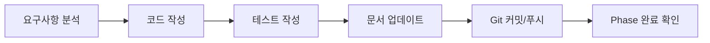

# 📜 Uncany 프로젝트 규칙

> 이 문서는 프로젝트의 모든 개발 규칙과 워크플로우를 정의합니다.

**최종 업데이트**: 2026-01-04

---

## 🎯 핵심 원칙

### 1. Bypass Permission 모드
**원칙**: 사용자 개입 최소화, AI 자율 진행

#### 자동 진행 항목
✅ 코드 작성 및 리팩토링
✅ 테스트 작성
✅ 문서 자동 업데이트
✅ Git 커밋/푸시
✅ 의존성 추가/업데이트
✅ 마이너 설정 변경

#### 확인 필요 항목
⚠️ 데이터베이스 스키마 변경 (마이그레이션)
⚠️ 프로덕션 배포
⚠️ 외부 서비스 연동 (비용 발생)
⚠️ 보안 관련 설정 변경

---

## 📝 자동 문서화 규칙

### 1. 업데이트 주기

| 파일 | 업데이트 시점 | 담당 |
|------|---------------|------|
| `PROJECT_PLAN.md` | Phase 시작/종료 시 | AI |
| `CHANGELOG.md` | 기능 완료 시마다 | AI |
| `docs/PHASE_{N}_REPORT.md` | Phase 종료 시 | AI |
| `docs/API.md` | 엔드포인트 추가 시 | AI |
| `docs/DATABASE.md` | 마이그레이션 실행 시 | AI |
| `README.md` | 주요 변경사항 발생 시 | AI |

### 2. Phase 보고서 형식

각 Phase 완료 시 다음 구조로 보고서 생성:

```markdown
# Phase {N} 완료 보고서

## 📊 개요
- **시작일**: YYYY-MM-DD
- **완료일**: YYYY-MM-DD
- **소요 시간**: X일
- **커밋 수**: X개

## ✅ 완료 항목
- [x] 기능 1
- [x] 기능 2

## 🐛 발견된 이슈
1. 이슈 설명 + 해결 방법

## 📈 성과 지표
- 테스트 커버리지: X%
- 코드 라인 수: X줄

## 🔜 다음 Phase 계획
- [ ] 다음 단계 작업들
```

---

## 🌿 Git 워크플로우

### 1. 브랜치 전략

```
main (프로덕션)
  └─ develop (통합)
       ├─ feature/auth-system
       ├─ feature/reservation-system
       └─ feature/ui-enhancement
```

### 2. 커밋 메시지 규칙

#### 형식
```
<type>(<scope>): <subject>

<body>

<footer>
```

#### 타입 (Type)
| 타입 | 설명 | 예시 |
|------|------|------|
| `feat` | 새 기능 | `feat(auth): 재직증명서 업로드 추가` |
| `fix` | 버그 수정 | `fix(reservation): 중복 예약 검증 오류 수정` |
| `docs` | 문서만 변경 | `docs(phase1): Phase 1 완료 보고서 생성` |
| `refactor` | 리팩토링 | `refactor(auth): Provider 구조 개선` |
| `test` | 테스트 추가 | `test(reservation): 예약 생성 Unit Test 추가` |
| `chore` | 빌드/설정 | `chore(deps): Riverpod 2.5로 업데이트` |
| `style` | 코드 포맷 | `style: Dart format 적용` |

#### Scope (범위)
- `auth`: 인증 관련
- `reservation`: 예약 시스템
- `classroom`: 교실 관리
- `audit`: 감사 로그
- `ui`: UI/UX
- `setup`: 프로젝트 설정
- `docs`: 문서

### 3. 자동 푸시 규칙

#### Feature 개발 시
```bash
# 1. Feature 브랜치 생성
git checkout -b feature/auth-system

# 2. 작업 완료 후 자동 커밋
git add .
git commit -m "feat(auth): 재직증명서 업로드 완료"

# 3. 즉시 푸시
git push -u origin feature/auth-system
```

#### Phase 완료 시
```bash
# 1. develop으로 머지
git checkout develop
git merge feature/auth-system

# 2. Phase 보고서 생성 및 커밋
# (AI가 자동 수행)

# 3. develop 푸시
git push origin develop

# 4. main으로 PR 생성
gh pr create --title "Phase 1 완료" --body "..."
```

---

## 🧪 테스트 규칙

### 1. 테스트 커버리지 목표
- **Unit Test**: 80% 이상
- **Widget Test**: 주요 화면 100%
- **Integration Test**: 핵심 플로우 100%

### 2. 테스트 작성 시점
- **Unit Test**: 비즈니스 로직 작성 직후
- **Widget Test**: UI 컴포넌트 완성 직후
- **Integration Test**: Phase 완료 전

### 3. 테스트 파일 명명 규칙
```
test/
├── unit/
│   └── auth/
│       └── auth_service_test.dart
├── widget/
│   └── auth/
│       └── login_screen_test.dart
└── integration/
    └── auth_flow_test.dart
```

---

## 📦 의존성 관리

### 1. 추가 규칙
```bash
# 프로덕션 의존성
flutter pub add package_name

# 개발 의존성
flutter pub add --dev package_name

# 자동 커밋
git commit -m "chore(deps): package_name 추가"
```

### 2. 업데이트 주기
- **주간**: `flutter pub outdated` 확인
- **월간**: 메이저 업데이트 검토

---

## 🎨 코드 스타일

### 1. Dart 스타일 가이드
- [Effective Dart](https://dart.dev/guides/language/effective-dart) 준수
- `flutter analyze` 경고 0개 유지

### 2. 포맷팅
```bash
# 자동 포맷
flutter format .

# 커밋 전 자동 실행
git config core.hooksPath .githooks
```

### 3. 파일 명명 규칙
- **Dart 파일**: `snake_case.dart`
- **클래스**: `PascalCase`
- **함수/변수**: `camelCase`
- **상수**: `UPPER_SNAKE_CASE`

---

## 🔒 보안 규칙

### 1. 환경 변수 관리
```bash
# .env 파일 (Git 무시)
SUPABASE_URL=https://xxx.supabase.co
SUPABASE_ANON_KEY=eyJhbGc...

# .env.example (Git 추적)
SUPABASE_URL=your_supabase_url
SUPABASE_ANON_KEY=your_anon_key
```

### 2. 민감 정보 금지
❌ API 키를 코드에 직접 작성
❌ 비밀번호를 평문으로 저장
❌ 개인정보를 로그에 출력

✅ 환경 변수 사용
✅ Argon2로 비밀번호 해싱
✅ 민감 정보는 마스킹 후 로깅

---

## 🚀 배포 규칙

### 1. 배포 환경
- **Development**: 자동 배포 (develop 브랜치 푸시 시)
- **Staging**: 수동 트리거 (Phase 완료 시)
- **Production**: PR 승인 후 수동 배포

### 2. 배포 전 체크리스트
- [ ] 모든 테스트 통과
- [ ] 문서 최신화 완료
- [ ] CHANGELOG 업데이트
- [ ] 환경 변수 확인
- [ ] 롤백 계획 수립

---

## 📊 진행 상황 추적

### 1. 일일 보고
매일 작업 종료 시 자동으로 생성:

```markdown
## 2026-01-04 작업 내역
- ✅ 프로젝트 계획서 작성
- ✅ Git 저장소 초기화
- 🔄 Flutter 프로젝트 설정 (진행 중)

**다음 작업**: Supabase 연동
```

### 2. Weekly Summary
매주 금요일 자동 생성:

```markdown
## Week 1 Summary (2026-01-01 ~ 2026-01-07)
- **완료**: Phase 0 - 프로젝트 설정
- **진행 중**: Phase 1 - 인증 시스템
- **블로커**: 없음
```

---

## 🤖 AI 개발 가이드

### 1. 작업 흐름


### 2. 의사결정 기준
- **간단한 변경**: 즉시 실행
- **중요한 변경**: 사용자에게 제안 후 실행
- **Critical 변경**: 반드시 사용자 승인 필요

---

## 📞 문제 해결

### 1. 이슈 발생 시
1. GitHub Issue 생성
2. 라벨 추가 (`bug`, `enhancement`, 등)
3. Phase 보고서에 기록
4. 해결 후 커밋 메시지에 `Closes #N` 추가

### 2. 긴급 이슈 (Hotfix)
```bash
# main에서 hotfix 브랜치 생성
git checkout -b hotfix/critical-bug main

# 수정 후 즉시 main으로 머지
git checkout main
git merge hotfix/critical-bug
git push origin main

# develop에도 반영
git checkout develop
git merge hotfix/critical-bug
git push origin develop
```

---

## 🔄 변경 이력

| 날짜 | 변경 내용 | 담당 |
|------|-----------|------|
| 2026-01-04 | 초안 작성 | Claude |

---

**이 문서는 프로젝트 진행에 따라 자동으로 업데이트됩니다.**
